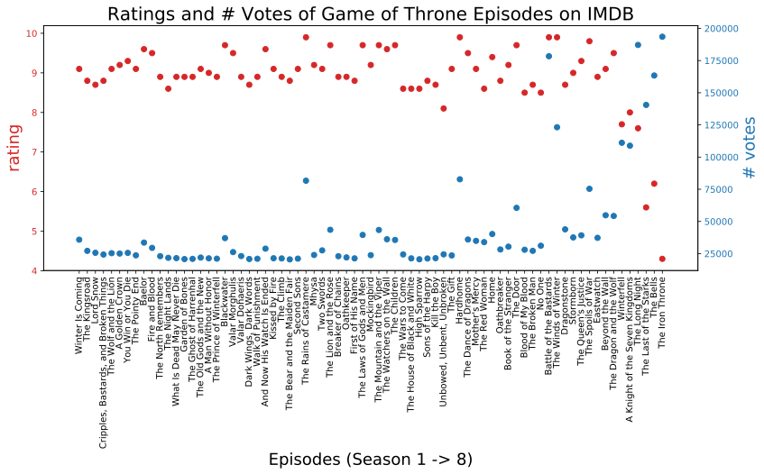

### A simple fact on how Game of Thrones season 8 went wrong.


# Web Scraping and Data Analysis 
## --- Game of Thrones Ratings and # Votes on IMDB


* Reference: https://www.dataquest.io/blog/web-scraping-beautifulsoup/

### Scrape data from one episode in Season 1, to learn how Beautiful Soup works
#### 1, Get the html code from source page.


```python
from requests import get
url = "https://www.imdb.com/title/tt0944947/episodes?season=1"
response = get(url)
print(response.text[:500])
```
    
    <!DOCTYPE html>
    <html
        xmlns:og="http://ogp.me/ns#"
        xmlns:fb="http://www.facebook.com/2008/fbml">
        <head>
             
            <meta charset="utf-8">
            <meta http-equiv="X-UA-Compatible" content="IE=edge">
    
        <meta name="apple-itunes-app" content="app-id=342792525, app-argument=imdb:///title/tt0944947?src=mdot">
    
    
    
            <script type="text/javascript">var IMDbTimer={starttime: new Date().getTime(),pt:'java'};</script>
    
    <script>
        if (typeof uet == 'function') {
     


```python
from bs4 import BeautifulSoup
html_soup = BeautifulSoup(response.text, 'html.parser')
type(html_soup)
```


    bs4.BeautifulSoup


#### 2, get the blocks that contain information of each episode from the webpage


```python
movie_containers = html_soup.find_all('div', class_ = ('list_item odd','list_item even'))
print(type(movie_containers))
print(len(movie_containers))
```

    <class 'bs4.element.ResultSet'>
    10


#### 3, Get one episode from the list of episodes


```python
ep1 = movie_containers[0]
```

#### 4, Get Episode title


```python
ep1.strong.text
```


    'Winter Is Coming'


#### 5, Get star rating:


```python
float(ep1.find('span', class_ = 'ipl-rating-star__rating').text)
```


    9.1


#### 6, Get number of total votes:


```python
vote=ep1.find('span', class_ = 'ipl-rating-star__total-votes').text
```


```python
int(vote.replace('(', '').replace(')','').replace(',',''))
```


    35831


### Integrating all the information:


```python
titles = []
seasons = [i+1 for i in range(8)]
ratings = []
votes = []
ep_season = []
```


```python
for season in seasons:
    url = "https://www.imdb.com/title/tt0944947/episodes?season="+str(season)
    response = get(url)
    html_soup = BeautifulSoup(response.text, 'html.parser')
    movie_containers = html_soup.find_all('div', class_ = ('list_item odd','list_item even'))
    for episode in movie_containers:
        # title
        title = episode.strong.text
        titles.append(title)
        # rating
        rating = float(episode.find('span', class_ = 'ipl-rating-star__rating').text)
        ratings.append(rating)
        # vote
        vote=episode.find('span', class_ = 'ipl-rating-star__total-votes').text
        vote=int(vote.replace('(', '').replace(')','').replace(',',''))
        votes.append(vote)
        # season
        ep_season.append(season)
```

### Data Analysis


```python
import pandas as pd
df = pd.DataFrame({'Season': ep_season,
                  'Title': titles,
                   'Rating': ratings,
                   '# Votes': votes
                  })
```


```python
print(df.info())
df
```

    <class 'pandas.core.frame.DataFrame'>
    RangeIndex: 73 entries, 0 to 72
    Data columns (total 4 columns):
    # Votes    73 non-null int64
    Rating     73 non-null float64
    Season     73 non-null int64
    Title      73 non-null object
    dtypes: float64(1), int64(2), object(1)
    memory usage: 2.4+ KB
    None


<div>
<table border="1" class="dataframe">
  <thead>
    <tr style="text-align: right;">
      <th></th>
      <th># Votes</th>
      <th>Rating</th>
      <th>Season</th>
      <th>Title</th>
    </tr>
  </thead>
  <tbody>
    <tr>
      <th>0</th>
      <td>35831</td>
      <td>9.1</td>
      <td>1</td>
      <td>Winter Is Coming</td>
    </tr>
    <tr>
      <th>1</th>
      <td>27137</td>
      <td>8.8</td>
      <td>1</td>
      <td>The Kingsroad</td>
    </tr>
    <tr>
      <th>2</th>
      <td>25640</td>
      <td>8.7</td>
      <td>1</td>
      <td>Lord Snow</td>
    </tr>
    <tr>
      <th>3</th>
      <td>24289</td>
      <td>8.8</td>
      <td>1</td>
      <td>Cripples, Bastards, and Broken Things</td>
    </tr>
    <tr>
      <th>4</th>
      <td>25337</td>
      <td>9.1</td>
      <td>1</td>
      <td>The Wolf and the Lion</td>
    </tr>
    <tr>
      <th>5</th>
      <td>25064</td>
      <td>9.2</td>
      <td>1</td>
      <td>A Golden Crown</td>
    </tr>
    <tr>
      <th>6</th>
      <td>25574</td>
      <td>9.3</td>
      <td>1</td>
      <td>You Win or You Die</td>
    </tr>
    <tr>
      <th>7</th>
      <td>23693</td>
      <td>9.1</td>
      <td>1</td>
      <td>The Pointy End</td>
    </tr>
    <tr>
      <th>8</th>
      <td>33580</td>
      <td>9.6</td>
      <td>1</td>
      <td>Baelor</td>
    </tr>
    <tr>
      <th>9</th>
      <td>29462</td>
      <td>9.5</td>
      <td>1</td>
      <td>Fire and Blood</td>
    </tr>
    <tr>
      <th>10</th>
      <td>23026</td>
      <td>8.9</td>
      <td>2</td>
      <td>The North Remembers</td>
    </tr>
    <tr>
      <th>11</th>
      <td>21740</td>
      <td>8.6</td>
      <td>2</td>
      <td>The Night Lands</td>
    </tr>
    <tr>
      <th>12</th>
      <td>21490</td>
      <td>8.9</td>
      <td>2</td>
      <td>What Is Dead May Never Die</td>
    </tr>
    <tr>
      <th>13</th>
      <td>20758</td>
      <td>8.9</td>
      <td>2</td>
      <td>Garden of Bones</td>
    </tr>
    <tr>
      <th>14</th>
      <td>20925</td>
      <td>8.9</td>
      <td>2</td>
      <td>The Ghost of Harrenhal</td>
    </tr>
    <tr>
      <th>15</th>
      <td>21923</td>
      <td>9.1</td>
      <td>2</td>
      <td>The Old Gods and the New</td>
    </tr>
    <tr>
      <th>16</th>
      <td>21340</td>
      <td>9.0</td>
      <td>2</td>
      <td>A Man Without Honor</td>
    </tr>
    <tr>
      <th>17</th>
      <td>21073</td>
      <td>8.9</td>
      <td>2</td>
      <td>The Prince of Winterfell</td>
    </tr>
    <tr>
      <th>18</th>
      <td>37058</td>
      <td>9.7</td>
      <td>2</td>
      <td>Blackwater</td>
    </tr>
    <tr>
      <th>19</th>
      <td>26177</td>
      <td>9.5</td>
      <td>2</td>
      <td>Valar Morghulis</td>
    </tr>
    <tr>
      <th>20</th>
      <td>23105</td>
      <td>8.9</td>
      <td>3</td>
      <td>Valar Dohaeris</td>
    </tr>
    <tr>
      <th>21</th>
      <td>20817</td>
      <td>8.7</td>
      <td>3</td>
      <td>Dark Wings, Dark Words</td>
    </tr>
    <tr>
      <th>22</th>
      <td>21006</td>
      <td>8.9</td>
      <td>3</td>
      <td>Walk of Punishment</td>
    </tr>
    <tr>
      <th>23</th>
      <td>28861</td>
      <td>9.6</td>
      <td>3</td>
      <td>And Now His Watch Is Ended</td>
    </tr>
    <tr>
      <th>24</th>
      <td>21391</td>
      <td>9.1</td>
      <td>3</td>
      <td>Kissed by Fire</td>
    </tr>
    <tr>
      <th>25</th>
      <td>21260</td>
      <td>8.9</td>
      <td>3</td>
      <td>The Climb</td>
    </tr>
    <tr>
      <th>26</th>
      <td>20515</td>
      <td>8.8</td>
      <td>3</td>
      <td>The Bear and the Maiden Fair</td>
    </tr>
    <tr>
      <th>27</th>
      <td>21098</td>
      <td>9.1</td>
      <td>3</td>
      <td>Second Sons</td>
    </tr>
    <tr>
      <th>28</th>
      <td>81647</td>
      <td>9.9</td>
      <td>3</td>
      <td>The Rains of Castamere</td>
    </tr>
    <tr>
      <th>29</th>
      <td>23950</td>
      <td>9.2</td>
      <td>3</td>
      <td>Mhysa</td>
    </tr>
    <tr>
      <th>...</th>
      <td>...</td>
      <td>...</td>
      <td>...</td>
      <td>...</td>
    </tr>
    <tr>
      <th>43</th>
      <td>21204</td>
      <td>8.8</td>
      <td>5</td>
      <td>Sons of the Harpy</td>
    </tr>
    <tr>
      <th>44</th>
      <td>21459</td>
      <td>8.7</td>
      <td>5</td>
      <td>Kill the Boy</td>
    </tr>
    <tr>
      <th>45</th>
      <td>24422</td>
      <td>8.1</td>
      <td>5</td>
      <td>Unbowed, Unbent, Unbroken</td>
    </tr>
    <tr>
      <th>46</th>
      <td>23588</td>
      <td>9.1</td>
      <td>5</td>
      <td>The Gift</td>
    </tr>
    <tr>
      <th>47</th>
      <td>82752</td>
      <td>9.9</td>
      <td>5</td>
      <td>Hardhome</td>
    </tr>
    <tr>
      <th>48</th>
      <td>35960</td>
      <td>9.5</td>
      <td>5</td>
      <td>The Dance of Dragons</td>
    </tr>
    <tr>
      <th>49</th>
      <td>34902</td>
      <td>9.1</td>
      <td>5</td>
      <td>Mother's Mercy</td>
    </tr>
    <tr>
      <th>50</th>
      <td>33941</td>
      <td>8.6</td>
      <td>6</td>
      <td>The Red Woman</td>
    </tr>
    <tr>
      <th>51</th>
      <td>40223</td>
      <td>9.4</td>
      <td>6</td>
      <td>Home</td>
    </tr>
    <tr>
      <th>52</th>
      <td>28226</td>
      <td>8.8</td>
      <td>6</td>
      <td>Oathbreaker</td>
    </tr>
    <tr>
      <th>53</th>
      <td>30404</td>
      <td>9.2</td>
      <td>6</td>
      <td>Book of the Stranger</td>
    </tr>
    <tr>
      <th>54</th>
      <td>60568</td>
      <td>9.7</td>
      <td>6</td>
      <td>The Door</td>
    </tr>
    <tr>
      <th>55</th>
      <td>28012</td>
      <td>8.5</td>
      <td>6</td>
      <td>Blood of My Blood</td>
    </tr>
    <tr>
      <th>56</th>
      <td>27166</td>
      <td>8.7</td>
      <td>6</td>
      <td>The Broken Man</td>
    </tr>
    <tr>
      <th>57</th>
      <td>31116</td>
      <td>8.5</td>
      <td>6</td>
      <td>No One</td>
    </tr>
    <tr>
      <th>58</th>
      <td>178367</td>
      <td>9.9</td>
      <td>6</td>
      <td>Battle of the Bastards</td>
    </tr>
    <tr>
      <th>59</th>
      <td>123203</td>
      <td>9.9</td>
      <td>6</td>
      <td>The Winds of Winter</td>
    </tr>
    <tr>
      <th>60</th>
      <td>43845</td>
      <td>8.7</td>
      <td>7</td>
      <td>Dragonstone</td>
    </tr>
    <tr>
      <th>61</th>
      <td>37575</td>
      <td>9.0</td>
      <td>7</td>
      <td>Stormborn</td>
    </tr>
    <tr>
      <th>62</th>
      <td>39210</td>
      <td>9.3</td>
      <td>7</td>
      <td>The Queen's Justice</td>
    </tr>
    <tr>
      <th>63</th>
      <td>75352</td>
      <td>9.8</td>
      <td>7</td>
      <td>The Spoils of War</td>
    </tr>
    <tr>
      <th>64</th>
      <td>37266</td>
      <td>8.9</td>
      <td>7</td>
      <td>Eastwatch</td>
    </tr>
    <tr>
      <th>65</th>
      <td>54785</td>
      <td>9.1</td>
      <td>7</td>
      <td>Beyond the Wall</td>
    </tr>
    <tr>
      <th>66</th>
      <td>54237</td>
      <td>9.5</td>
      <td>7</td>
      <td>The Dragon and the Wolf</td>
    </tr>
    <tr>
      <th>67</th>
      <td>111125</td>
      <td>7.7</td>
      <td>8</td>
      <td>Winterfell</td>
    </tr>
    <tr>
      <th>68</th>
      <td>108840</td>
      <td>8.0</td>
      <td>8</td>
      <td>A Knight of the Seven Kingdoms</td>
    </tr>
    <tr>
      <th>69</th>
      <td>187132</td>
      <td>7.6</td>
      <td>8</td>
      <td>The Long Night</td>
    </tr>
    <tr>
      <th>70</th>
      <td>140531</td>
      <td>5.6</td>
      <td>8</td>
      <td>The Last of the Starks</td>
    </tr>
    <tr>
      <th>71</th>
      <td>163377</td>
      <td>6.2</td>
      <td>8</td>
      <td>The Bells</td>
    </tr>
    <tr>
      <th>72</th>
      <td>193515</td>
      <td>4.3</td>
      <td>8</td>
      <td>The Iron Throne</td>
    </tr>
  </tbody>
</table>
<p>73 rows × 4 columns</p>
</div>


### Plot with GoT episode ratings and number of votes on IMDB, in one graph


```python
import numpy as np
import matplotlib.pyplot as plt
%matplotlib inline
%config InlineBackend.figure_format = 'svg'
num_ep = [i+1 for i in range(df.shape[0])]
fig, ax1 = plt.subplots()

color = 'tab:red'
ax1.set_xlabel('Episodes (Season 1 -> 8)', fontsize = 18)
ax1.set_ylabel('rating', color=color, fontsize=18)
plt.xticks(num_ep, titles, rotation=90, fontsize=10)
ax1.scatter(num_ep, ratings, color=color)
ax1.tick_params(axis='y', labelcolor=color)

ax2 = ax1.twinx()  # instantiate a second axes that shares the same x-axis

color = 'tab:blue'
ax2.set_ylabel('# votes', color=color, fontsize=18)  # we already handled the x-label with ax1
ax2.scatter(num_ep, votes, color=color)
ax2.tick_params(axis='y', labelcolor=color)

#fig.tight_layout()  # otherwise the right y-label is slightly clipped
fig.set_size_inches(13, 5)
plt.title('Ratings and # Votes of Game of Throne Episodes on IMDB', fontsize=20)
plt.show()
```


#### Comments of the graph:
* Red dots stand for episode ratings --- ratings have been generally high in earlier seasons, but plummeted in Season 8.
* Blue dots stand for number of votes for each episode --- Season 8 has attracted highest number of voters. 
* One can not make a simple conclusion that the more the voters, the lower the rating, because in earlier seasons the episodes with most voters are also the ones with highest ratings (e.g., the Rains of Castamere, Hardhome, Battle of the Bastards, the Winds of Winter)

#### And now my watch has ended.
```python

```
